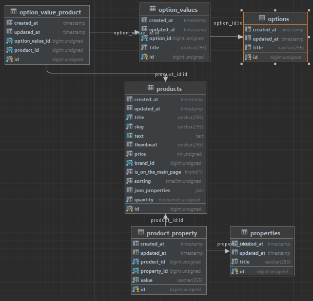

Чё плюс минус было интересно/ново/потенциально полезно:

### Фильтры товаров

- Абстрактный класс, который описывает поведение
  классов которые будут наследовать его - [AbstractFilter](src/Domain/Catalog/Filters/AbstractFilter.php)
- Классы, которые содержат все данные о фильтрах: тип, имя, логика применения фильтра(билдер), ссылку на view и
  т.д. - [app/Filters](app/Filters). Их же используем для отрисовке на фронте при помощи __toString(). Нэймспейсы с
  именами храним в базе данных(по идее какие-то еще данные можно хранить в базе и давать редактировать заказчику, надо
  думать как и что именно туда пихать), а регаем в провайдере, при
  помощи [FilterManager](src/Domain/Catalog/Filters/FilterManager.php)
- Хелпер [src/Support/helpers.php](src/Support/helpers.php#L22)

### Order processing pipeline

- Интерфейс с единственным методом - [OrderProcessPipe](src/Domain/Order/Contracts/OrderProcessPipe.php)
- Процессы, его реализующие - [src/Domain/Order/Processes](src/Domain/Order/Processes)
- Использвуем [CheckoutController](app/Http/Controllers/CheckoutController.php#L68)

### Thumbnails

- Эндпоинт(/thumbnails/{dir}/{method}/{size}/{folder}/{file?}), который чекает если уже есть, генерит и отдаёт
  тамбнэйл - [ThumbnailController](app/Http/Controllers/ThumbnailController.php)
  Конфиг - контроль доступных разрешений.
- Трэйт, метод makeThumbnail генерит url на наш эндпоинт [HasThumbnail](app/Traits/Model/HasThumbnail.php#L14)

### Seeders

- Расширяет base faker provider [FakerImageProvider](src/Support/Testing/FakerImageProvider.php). Тут дергает картинку
  из fixtures folder, генерит копию с нужным именем, отдаёт путь, который сейвим в бд

### Full text indexing

- [2024_02_21_164333_change_products_table.php](database/migrations/2024_02_21_164333_change_products_table.php)
  индексируем.
- [ProductViewModel](src/Domain/Product/ViewModels/ProductViewModel.php#L34) ищем.

### Seo заголовки

- [2024_03_05_192001_create_seos_table.php](database/migrations/2024_03_05_192001_create_seos_table.php) Таблица в бд
- [app/Models/Seo.php](app/Models/Seo.php)
- Шэрим с вьюхами [SeoMiddleware](app/Http/Middleware/SeoMiddleware.php). Опираемся на url'ы

### EAV

- Денормализованные пропертис в модели
  продукта [src/Domain/Product/Models/Product.php](src/Domain/Product/Models/Product.php#L80)
- Job [SavePropertiesForProductJob](app/Jobs/SavePropertiesForProductJob.php)
- Observer [ProductObserver](app/Observers/ProductObserver.php#L15)
- Ещё несколько eav реализаций с других
  проектов: [lucid.app auth required, запривачено в моём акке](https://lucid.app/lucidchart/111f8415-5cf0-4514-99f7-731a45afa69f/edit?invitationId=inv_763bc7ae-1e5d-47de-8466-dd71b666e4ea&page=0_0#)
- Текущая для products, options, properties 
